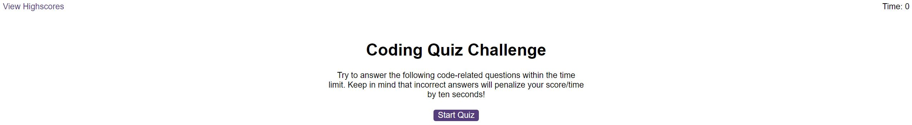
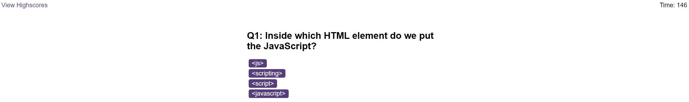

# Code-Quiz
A repo containing a timed quiz on JavaScript fundamentals that stores high scores

## Description

This project aims create a timed quiz in which the app will run in the browser, and will feature dynamically updated HTML and CSS powered by JavaScript code.

## Table of Contents

- [Installation](#installation)
- [Usage](#usage)
- [Credits](#credits)
- [License](#license)

## Installation

Follow the URL link provided: https://jsskilton.github.io/Code-Quiz/

## Usage

This is the quiz landing page. To view highscores, click the 'View Highscores' button. To start the quiz, click the 'Start Quiz' button.

After starting the quiz, each question will appear. Time remaining is shown in the top right corner - this is the score that will be saved. After selecting an option, a message will display whether the answer is correct or incorrect. For each incorrect answer, 10 seconds is deducted from the time.

Highscores are stored in local storage and shown on the screen below. There is the option to clear highscores by pressing the 'Clear Highscores' button.

## Credits

This README was created by following the Good-README-Guide on git.bootcampcontent:

https://git.bootcampcontent.com/uk-edx-16-week/UK-VIRT-FE-PT-10-2023-U-LOLC/-/blob/main/01-html-git-github-module/04-code-refactor-lesson/challenge/Good-README-Guide.md

Questions were taken from w3schools.com:

https://www.w3schools.com/quiztest/quiztest.asp?qtest=JS

## License

MIT License